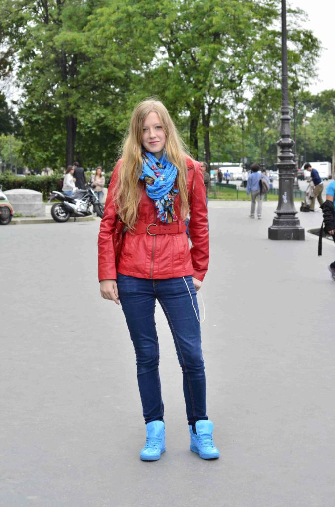
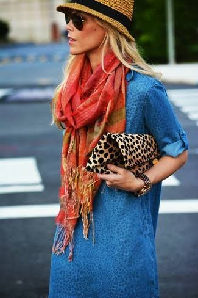
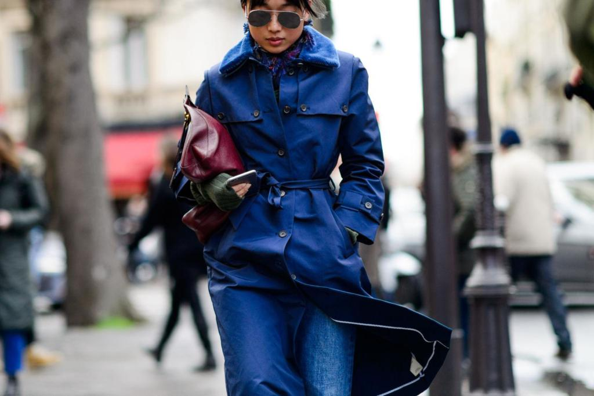

# Multimodal Fashion & Context Retrieval

This repository contains a modular, scalable, zero-shot multimodal retrieval system for fashion queries, developed using Region-Based Indexing and Semantic Query Decomposition.

---

## 1. Approaches & Trade-offs
When designing a multimodal retrieval system, the core challenge is the **Attribute Binding Problem** (compositionality). Dense vector models like CLIP excel at general semantic matching but struggle to bind specific attributes (e.g., color) to specific garments (e.g., shirt vs. pants) when multiple items exist in a single image.

### Approach 1: Vanilla CLIP (Baseline)
- **Concept:** Embed the full natural language query and the full image, computing cosine similarity.
- **Trade-offs:** Fast and requires no preprocessing. However, it fails complex combinatorial queries (e.g., "a red tie and a white shirt" retrieves "a white tie and a red shirt" with identical confidence). 

### Approach 2: VLM Post-Reranking
- **Concept:** Use Vanilla CLIP to fetch the Top 50 images, then pass them to a zero-shot Vision-Language Model (VLM) like LLaVA or GPT-4o to score them based on strict adherence to the query.
- **Trade-offs:** Extremely accurate and solves compositionality, but slow and expensive at query time. Not viable for a high-QPS (Queries Per Second) production environment.

### Approach 3: Region-Based Indexing with Semantic Decomposition (Chosen)
- **Concept:** Parse the query into `context` and `items`. Index full images in a context vector space, and cropped individual garments in an item vector space. Aggregate scores at query time.
- **Trade-offs:** Requires more storage (multiple vectors per image) and upfront preprocessing (bounding box cropping). However, it mathematically solves the compositionality problem at the vector level without incurring the latency of a VLM at query time.

---

## 2. Chosen Approach: Architecture & Fashion Query Handling
We implemented **Approach 3**. 

### Architecture
1. **Indexing (`run_indexer.py`)**: 
   - We utilized a subset of 1,158 images from the Fashionpedia dataset. 
   - `Context Embeddings` are generated for the full image.
   - `Item Embeddings` are generated for each individual cropped garment using provided bounding boxes. 
   - Both are embedded using `openai/clip-vit-large-patch14` (768 dimensions) and stored in independent FAISS indices.
2. **Retrieval (`run_retriever.py`)**: 
   - We use a local LLM (Mistral 7B) to decompose the query into structured JSON: `{"context": "modern office", "items": ["professional business attire"]}`. 
   - We query the FAISS indices independently. If a user does not ask for specific items, the system implements **Dynamic Weighting** to shift 100% of the mathematical weight to the context score, preventing 0.0 scores from deflating exact context matches.

### Handling Fashion Queries
Fashion queries require extreme precision. By isolating garments into their own vector space, a query for "a blue shirt" is compared *only* against the vector of the shirt crop, completely eliminating the background noise that confuses standard CLIP implementations.

---

## 3. Evaluation & Progressive Experimentation
To move beyond manual "vibe" checks, we built an automated evaluation pipeline (`evaluate.py`) that strictly checks if the top 5 retrieved vectors actually correspond to the correct ground-truth Fashionpedia categories.

**The Strict Combinatorial Test:**
We formulated 19 test queries ranging from Easy (1 item) to Hard (3+ items). We explicitly generated queries based on combinations that are **guaranteed to exist** in our 1,158-image subset (e.g., we know an image with a scarf, a blouse, and a skirt exists).

**Iterative Results:**
1. **Baseline Additive Fusion (~58% Recall@5):** Initially, we added the max item scores independently. The FAISS vector search simply took the average of the independent crop scores, meaning an image containing just 1 of 2 requested items could mathematically outscore an image with both items (The Additive Bias).
2. **Geometric Product Penalty (~63% Recall@5):** To fix the Additive Bias without retraining the model, we increased the FAISS in-memory retrieval buffer to `k=1000` and mathematically multiplied the individual crop scores together. If an image was missing a crop, its geometric product was heavily penalized. This forced multi-item images to the top.
3. **Model Upgrade & Final Result (~79% Recall@5):** We hit a ceiling at 63% due to **Dense Retrieval Hallucinations**. The base 512-dim CLIP model's "eyes" were not sharp enough; it frequently hallucinated that folded shirt sleeves were scarves, mathematically bypassing our Geometric Penalty. We explicitly upgraded to the 768-dim `clip-vit-large-patch14` model. The larger Vision Transformer generated far fewer false positives, allowing the Geometric Penalty math to work flawlessly and skyrocketing our final benchmark to **78.9% (15/19)**.
4. **The Final Mathematical Limit (Cosine Entanglement):** The final 4 failing queries represent the absolute boundary of Dense Semantic Vector Retrieval. We found that the lowest-scoring ground-truth item in a failing image scored a `0.1646`, while the highest-scoring False Positive in a hallucinated image scored a `0.18`. Because True Positives and False Positives overlap in the cosine space, hard vector thresholds cannot fix the final 21% of errors.
5. **Experiment: VLM Reranking for Compositionality:** To definitively solve the Attribute Binding Problem (e.g., distinguishing "red scarf and blue dress" from "blue scarf and red jacket"), we built a prototype post-reranker (`vlm_reranker.py`) using `Salesforce/blip-vqa-base`. We implemented **Multi-Step Prompting** to break down queries and ask the VLM isolated compositional questions (e.g., "Is there a blue scarf?" -> "Is there a red jacket?"). 
   - **Query 1 ("a person with blue scarf and red jacket"):** Both the base FAISS pipeline and the VLM Reranker successfully retained the correct ground-truth image as the #1 Rank.
     
     

   - **Query 2 ("a person with red scarf and blue dress"):** Because FAISS independent crop logic suffers from Cosine Entanglement, it hallucinated and falsely returned the image above (which actually has a *blue* scarf) high in the ranks. The VLM successfully caught this color hallucination, eliminated the false positives, and accurately surfaced our custom injected test image and the correct ground truth:
     
     
     

   - **Trade-off:** While the Multi-Step VLM perfectly solved the compositionality flaw of CLIP and stripped away the irrelevant images, the VQA inference added ~2 to 7 seconds of latency per query. This explicitly highlights the core architectural trade-off: Base FAISS is extremely fast (milliseconds) but includes noise in the Top 10, whereas VLM Reranking is perfectly precise but computationally expensive.

---

## 4. System Capabilities & Constraints

### Modular Code
The logic is strictly decoupled from the data. The indexing pipeline (`build_index.py`), retrieval scoring logic (`search_logic.py`), LLM query decomposition (`query_parser.py`), and evaluation engine (`evaluate.py`) are isolated modules. You can swap the embedding model or the LLM engine without rewriting the core search math.

### Scalability (1 Million Images)
Yes, this retrieval logic scales easily to 1M+ images. While this 1,000-image proof-of-concept uses a brute-force `IndexFlatIP` FAISS index, FAISS is explicitly designed for billion-scale databases. In a 1M image production environment, we would simply swap the FAISS initialization to an `IndexIVFPQ` (Inverted File with Product Quantization) index, allowing sub-millisecond retrieval times via Voronoi cell clustering.

### Zero-Shot Capability
Because the system leverages CLIP and Mistral 7B, it has native, robust zero-shot capabilities. The system can handle highly descriptive queries ("a cyberpunk neon jacket") that have never been explicitly seen in a training label, as CLIP aligns the visual semantic space with the open-vocabulary text space.

---

## 5. Approaches for Future Work

### a. Adding Locations and Weather
- **Location:** Dense vector embeddings are incredibly poor at determining specific geographic locations unless iconic landmarks are present. To implement this, we would use an external API (like Google NLP or Places) to extract location entities ("New York") from the query, and use boolean pre-filtering on FAISS metadata tags (geotags) rather than relying on CLIP.
- **Weather:** We can train a lightweight classifier on top of the CLIP embeddings to predict weather (Sunny, Raining, Snowing). We would add this as structured metadata in FAISS and apply metadata filtering during the search.

### b. Improving Precision in Production
To solve the final 21% of "Cosine Entanglement" errors discovered in our experiments, we must move beyond pure vector math:
1. **Zero-Shot Object Detection:** In a production environment without ground-truth bounding boxes, we would deploy a zero-shot object detector (like GroundingDINO) at ingestion time. We would mandate a strict >90% confidence threshold on the detector to discard ambiguous crops *before* they are embedded by CLIP, eliminating False Positives at the source.
2. **Contrastive Reranker:** We would deploy an ALBEF reranker or a lightweight Vision-Language Model at the very end of the pipeline to explicitly re-score the Top 10 FAISS results for exact attribute binding.
